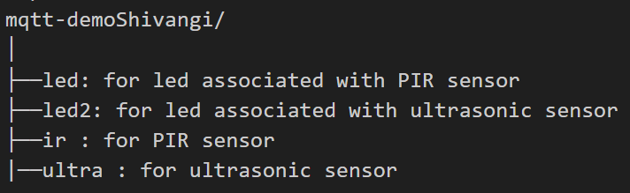
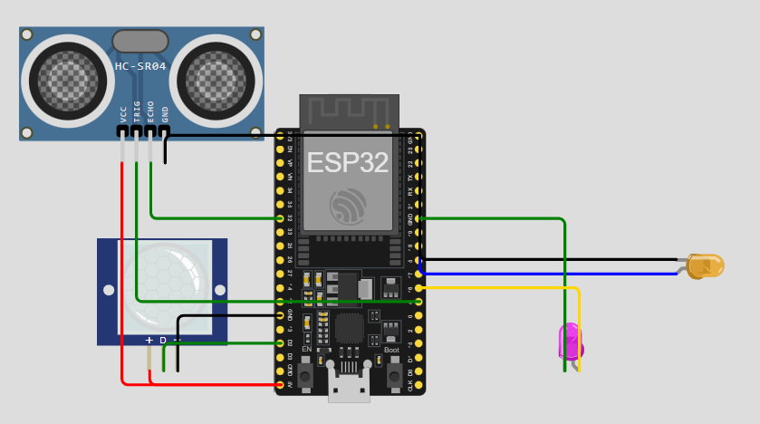
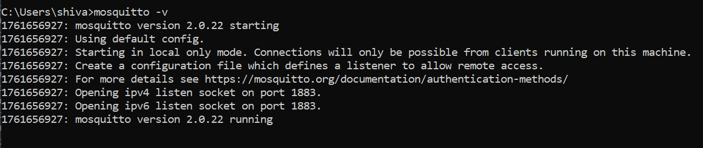
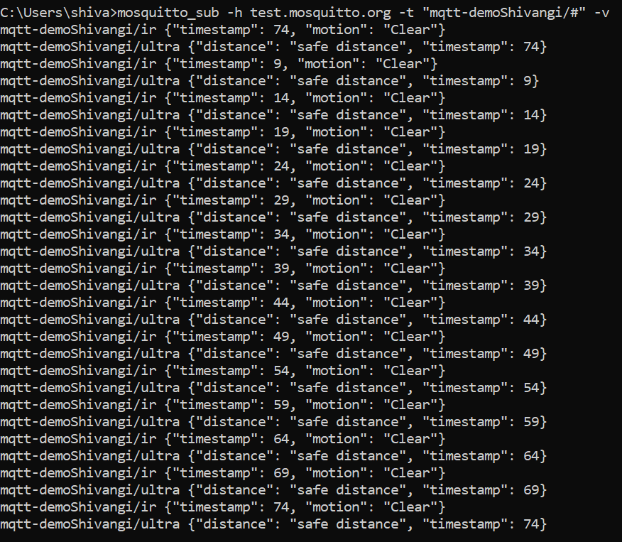
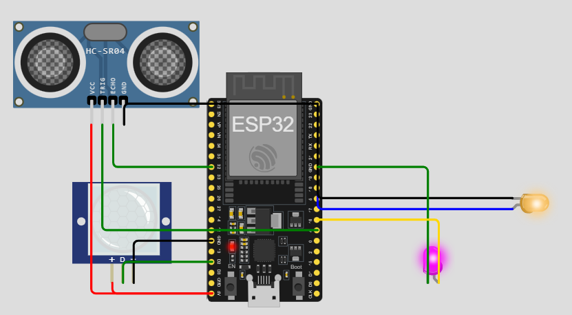

Files Included:
1. diagram.json:circuit layout
2. main.py:main code
3.README.md – Documentation

Topic tree:

  

Broker Commands:

1. 
Subscribe to sensor data:

mosquitto_sub -h test.mosquitto.org -t "mqtt-demoShivangi/#"

2.
Turn on LED associated with PIR sensor:

mosquitto_pub -h test.mosquitto.org -t "mqtt-demoShivangi/led" -m "on"

3.
Turn on LED associated with Ultrasonic sensor:

mosquitto_pub -h test.mosquitto.org -t "mqtt-demoShivangi/led2" -m "on"

4.
Turn off LED associated with PIR sensor:

mosquitto_pub -h test.mosquitto.org -t "mqtt-demoShivangi/led" -m "off"

5.
 Turn off LED associated with Ultrasonic sensor:

mosquitto_pub -h test.mosquitto.org -t "mqtt-demoShivangi/led" -m "off"

Screenshots:

  

  

  

  

